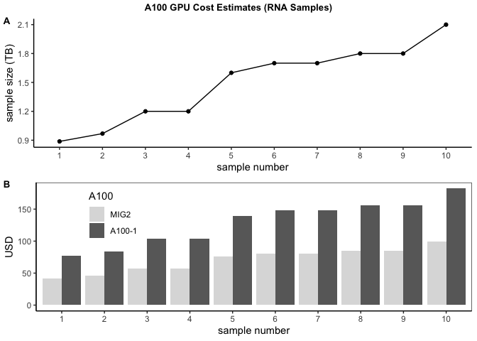

# Long-read-sequencing-README

## Brief summary

### Long-read Sequencing (LR-Seq)

To date, most large-scale genetic sequencing efforts for Alzheimer's disease (AD) and related dementias (ADRD) have been performed using short-read DNA sequencing. Although these approaches can identify single nucleotide changes and small indels, they are not optimized to identify large structural variations or repeat expansions. Furthermore, many areas of the genome cannot be accurately sequenced with this technology, like homologous elements, highly GC-rich regions, centromeric regions, and telomeres.

Long-read sequencing enables us to generate accurate genetic sequencing data for challenging genomic regions to identify structural variants driving Alzheimer's disease and related dementias pathology. A greater understanding of the genetic architecture of the Alzheimer's disease and related dementias genome will lead to further insight into the disease and pathway mechanisms underlying them and new potential therapeutic targets for these diseases.

With this research, we will build a public resource consisting of long-read genome sequencing data from a large number of confirmed people with Alzheimer's disease and related dementias and healthy individuals. We will make both the raw and processed data publicly available to the community, along with our analysis pipeline, algorithms, and optimized DNA isolation protocols. Data processing pipeline onsists of Basecalling/MethylationCalling __(using Guppy in super accuracy mode)__, Quailt control __(using Seqkit)__, Mapping to reference genome and Variant Calling __(using pepper_deepvariant tool)__.

## Basecalling/Methylationcalling (Guppy v6.1.2)
__(Super accuracy Model dna_r9.4.1_450bps_modbases_5mc_cg_sup_prom.cfg)__

**TL/DR:**

-   Guppy6.1.2 **basecalling+BAM** in MIG2 mode **(using SUP model)** on
    GCP with persistent use discount for 10 RNA and 97 DNA samples cost
    a total of **$34290.86**. Please see Figure 3 for detailed
    calculations.
-   Guppy6.1.2 **basecalling** in MIG2 mode **(using SUP model)** on GCP
    with persistent use discount is roughly **$47.25 ** for average RNA
    samples at **1.2 TB** and **$130.73** for average DNA samples at
    **1.2 TB**.
-   **Methylation** (5mC) calling (using Guppy basecalled fastq file)
    with **minimap2** based alignment costs **$52.25** for average RNA
    samples at **1.2 TB** and **$145.73** for average DNA samples at
    **1.2 TB**.

We have developed a __[shiny app](https://lrseqapp.shinyapps.io/lrapp/)__ for optimized resource and cost estimation for DNA and RNA samples using A100 GPU in MIG mode for basecalling and methylation calling. This repo also includes scripts for quality measures for long read fastq file, mapping of unmapped BAM files and variant calling. Some general purpose post processing scripts are also included in the repo.  

## Introdunction

A100 GPU on google cloud platform (GCP) can be used in **full** as well
as in multi-instance GPU **(MIG)** mode. Here we compare our results for
guppy **basecalling** on 1, 2 and 4 A100 GPUs in **full** mode with
those obtained from single A100 in **MIG** mode. We also compare our
results on **methylation-calling** using guppy, minimap2 and nanopolish.

### A100 in MIG mode

Single A100 GPU (40 GB) can be configured in 5 different MIG modes for
best performance (Table 1). We have tested A100 in 7 (MIG7), 3 (MIG3)
and 2 (MIG2) GPU instances as well as 1, 2 and 4 A100 GPUs in full mode
for RNA and DNA samples. 

Source
<https://docs.nvidia.com/datacenter/tesla/mig-user-guide/#:~:text=The%20new%20Multi%2DInstance%20GPU,resources%20for%20optimal%20GPU%20utilization.>

### A100 configuration and cost (persistent discount) on GCP

Below table show general specification of A100 available on GCP (40 GB
SMX, 108 streaming multiprocessors (SMs) and a toal of 6912 cuda cores)
with cost/hr **(persistent use discount 30% reduced cost)** for each
configuration. In all our calculations we have used A100 with 4TB of
ssd.

> Please note that Guppy base caller crashes if run on data from gbucket
> (due to disk latency issues), all these tests were done by attaching a
> 4TB persistent SSD disk with a2-highgpu-1g VM (default VM for A100
> GPU). To run more than one samples simultaneously (say 3 with 3
> multi-instances, we need \~ 7TB of persistent disk as some samples are
> \> 3 TB)

    ------------------------------------------------------------------------------------
        GPU      Memory   Cores   SMs   Cores_SM   GPCs   Cost_hr   vCPUs   RAM    Disk 
    ----------- -------- ------- ----- ---------- ------ --------- ------- ------ ------
       A100       40GB    6912    108      64       7      $2.79     12     85GB   10GB 

       A100       40GB    6912    108      64       7      $3.75     12     85GB   4TB  

     A100-MIG2    20GB    2688    42       64       -      $3.75     12     85GB   4TB  

     A100-MIG3    10GB    1792    28       64       -      $3.75     12     85GB   4TB  
    ------------------------------------------------------------------------------------

Table 2. A100 (in full and MIG MODE) configurations. Rows 1-2. A100 in
**full** mode with 10GB default and 4TB Persistent disk respectively.
Rows 3-4. A100 in MIG2 and MIG3 modes used for current benchmarking.

For more details on A100 GPU, see
<https://www.techpowerup.com/gpu-specs/a100-pcie.c3623>

<https://www.nvidia.com/content/dam/en-zz/Solutions/Data-Center/a100/pdf/nvidia-a100-datasheet-us-nvidia-1758950-r4-web.pdf>

### Guppy base- and methylation-calling on A100 GPUs

#### Guppy basecalling

Results for guppy basecalling in MIG (MIG2 and MIG3) mode on a single
A100 GPU as well as on 1 (A100-1), 2 (A100-2) and 4 (A100-4) A100 GPUs
are shown in Figure 1 & 2 for an RNA and DNA sample (each of 1.2 TB) .

> Please note that in MIG2 mode, an RNA and DNA sample was split into 2
> different folders (equal number of FASTA5 files) and 2 guppy
> basecaller’s were run on these sub-samples. Also note that basecalling
> rates (Figure 1A) in mig modes are shown as sum of rates for all
> instances and total time (Figure 1B) is the average of all instances.

As can be seen from Figure 1A, guppy basecalling rate in MIG2 mode is
**\~2X** faster than in single A100 in full mode and gave comparable
performance on 2 A100 GPUs in full mode for both RNA and DNA samples.
Furthermore, total base calling completion time for both RNA and DNA
samples in MIG2 mode is compareable to that on 2 A100 GPUs in full mode
(Figure 1B).

> Results for MIG7 mode are slower than MIG3 and MIG2 mode and hence are
> not reported here.

> Please note that calculations for DNA in full A100 mode (A100-1) were
> not completed (due to long run time, we terminated the job).

Figure 1. Guppy basecalling on A100 GPU in MIG and full mode.

Consequently, total cost for RNA and DNA replicates is **\~ 1/2** in
MIG2 mode than on 2 A100 GPUs in full mode (Figure 1C). Figure 1D gave
estimate for cost per TB for both DNA and RNA samples.

> We conclude that MIG2 mode gave best cost for both RNA and DNA
> samples.

> Major driver for higer cost in DNA replicates as compared to RNA
> replicates is due to larger number of samples (raw signals per TB) in
> DNA (3X as many as RNA samples for same size (in TB) of FASTA5 files)
> replicates.

> Note that in the case of DNA, MIG2 mode jobs finishes with 3 to 4 hr
> time difference causing little higher cost. A workarond for this would
> be submit two parallel jobs, one on each MIG machine to maximimize
> A100 utilization.

In summary, A100 GPU in MIG mode is **almost 0.54** time cheaper than
that of single A100 in Full mode for RNA samples. In the case of DNA
samples, MIG mode is **almost 0.68** times cheaper than that of 4 A100
GPUs.

#### Guppy Basecalling + Alignment (methylation-calling)

Following our optimized setting for guppy basecalling on A100 GPU in
MIG2 mode, we tested guppy on A100 GPU in MIG2 mode (Figure 2) for
basecalling and alignment to hg38 reference fasta. Guppy basecalling +
alignment in MIG2 mode is **almost 2.56 more costly** for RNA sample
where as for DNA sample it is **1.7 more costly** than basecalling
alone.

Guppy generated **modified-base bam** file was processed to aggregate
5mC bases in bedmethyle bed file using modbam2bed script
<https://github.com/epi2me-labs/modbam2bed> on a 16 vCPUs, 64 GB RAM and
3TB SSD VM. This step costs **\~$3** for RNA sample and **\~$6** for DNA
sample.

> For methylation calling, overall this pipeline costs **$147.9** for
> RNA sample and **$272.18** for DNA sample.

Figure 2. Guppy basecalling and alignment on A100 GPU in MIG2 mode.

### Guppy basecalling on A100 GPUs followed by methylation-calling using minimap2 on 16 vCPUs, 64 GB RAM and 3TB SSD VM

Next we used guppy basecalled fastq file (for passed reads) to generate
(modified-base) BAM file using minimap2 and process resulting BAM file
using modbam2bed script (see above). For methylation calling, this
pipeline incurs, in addition to guppy basecalling cost (Figure 1), an
additional **\~$5** for RNA and **\~$15** for DNA sample.

> For methylation calling, overall this pipeline costs **$61.7** for RNA
> sample and **$171.88** for DNA sample.

### Guppy basecalling on A100 GPUs followed by methylation-calling using minimap2 and nanopolish on 16 vCPUs, 64 GB RAM and 3TB SSD VM

Another option we tested on guppy basecalled fastq file (for passed
reads) to generate (modified-base) BAM file using minimap2 followed by
nanopolish for methylation calling. This pipeline incurs, in addition to
guppy basecalling cost (Figure 1), an additional **\~$51** for RNA and
**\~$62** for DNA sample.

> For methylation calling, overall this pipeline costs **$107.7** for
> RNA sample and **$218.88** for DNA sample.

### Guppy Basecalling+BAM Cost Prediction for RNA and DNA samples

Based on Guppy6.1.2 in MIG2 mode for Basecalling+BAM calculations, we
calculated total estimates for 10 RNA and 97 DNA samples.

For 10 RNA samples, total estimates is **$1805.99** and for 97 DNA
samples, it is **$32484.87**.

Figure 3 shows cost estimate breakdown for each of the RNA and DNA
samples.

Figure 3. A) RNA and B) DNA samples cost analysis for A100 GPU in MIG2
mode

### Cost Prediction for RNA and DNA samples

Next, based on above estimates (for guppy basecalling), we have
calculated cost per sample for each RNA and DNA sample in various A100
GPU configurations.

#### RNA Samples cost analysis

Figure 4 and Table 3 presents cost estimation for 10 RNA samples. As
seen in Table 1 and Figure 3, cost estimate for each RNA sample is **\~
1/2** in MIG2 mode than in the case of single A100 in full mode.

<table>
<caption>
Predicted Cost
</caption>
<thead>
<tr>
<th style="text-align:left;">
MODE
</th>
<th style="text-align:right;">
Cost
</th>
</tr>
</thead>
<tbody>
<tr>
<td style="text-align:left;font-weight: bold;font-style: italic;color: white !important;background-color: black !important;">
MIG2
</td>
<td style="text-align:right;font-weight: bold;font-style: italic;color: white !important;background-color: black !important;">
707
</td>
</tr>
<tr>
<td style="text-align:left;">
MIG3
</td>
<td style="text-align:right;">
811
</td>
</tr>
<tr>
<td style="text-align:left;">
a100-1
</td>
<td style="text-align:right;">
1300
</td>
</tr>
</tbody>
</table>

Table 3. Total cost for 10 RNA samples

Figure 4. RNA samples cost analysis. A) RNA samples sizes, B) Price
comparison between MIG2 and single A100 in full mode.

#### DNA Samples cost analysis

Figure 5 and Table 4 show cost analysis for 97 DNA samples. In the case
of DNA samples, MIG2 mode is the cheapest mode among MIG2, 2 A100 and 4
A100 GPUs with A100-2 being almost **\~2X** as expensive as MIG2 mode.

<table>
<caption>
Predicted Cost
</caption>
<thead>
<tr>
<th style="text-align:left;">
MODE
</th>
<th style="text-align:right;">
Cost
</th>
</tr>
</thead>
<tbody>
<tr>
<td style="text-align:left;font-weight: bold;font-style: italic;color: white !important;background-color: black !important;">
MIG2
</td>
<td style="text-align:right;font-weight: bold;font-style: italic;color: white !important;background-color: black !important;">
19146
</td>
</tr>
<tr>
<td style="text-align:left;">
A100-2
</td>
<td style="text-align:right;">
36425
</td>
</tr>
<tr>
<td style="text-align:left;">
A100-4
</td>
<td style="text-align:right;">
28034
</td>
</tr>
</tbody>
</table>

Table 4. Total cost for 97 DNA samples

Figure 5. DNA samples cost analysis. A) DNA sample sizes, B) Price
comparison between MIG2, 2 A100 and 4 A100 GPUs in full mode.

## Basic Quality Control (SeqKit)
We have used SeqKit, an ultrafast toolkit to check FASTQ files generated by guppy to calculate num\_seqs, sum\_len, min\_len, avg\_len, max\_len, Q1, Q2, Q3, sum\_gap, N50, Q20(%), Q30(%) and GC(%) on all DNA and RNA samples (script seqkit\_scr.sh).
## Mapping to reference genome (minimap2)
Ref Genome: GCA\_000001405.15\_GRCh38\_no\_alt\_analysis\_set.fna.gz reference genome)

Guppy generated (unmapped) BAM files were then aligned to reference genome using minimap2 by introducing methylation related tags (Please see vcalling\_scr.sh for details).
## Variant Calling (using pepper_deepvariant)

All mapped bam files were variant called using pepper\_deepvariant with appropriate setting (Please see vcalling\_scr.sh for details).
## Publications

XXX

## Graphical overview

XXX

## Overview of this code repo

1. XXXX
    1. Clinvar analyses INDI lines
    2. Genetic risk score analysis of INDI lines
    3. Genomic alteration analysis of INDI lines
2. XXX
   1. XXX
   2. XXX
3. XXX
   1. XXX
   2. XXX

## Contact details

For more information or questions please email:

## Full long-read sequencing Team:

The long-read sequencing team:

Adam Phillippy, NHGRI
Benedict Paten, UCSC
Bryan Traynor, NIA
Cornelis Blauwendraat, NIA
Fritz Sedlazeck, Baylor College of Medicine
Sonja Scholz, NINDS
and more

