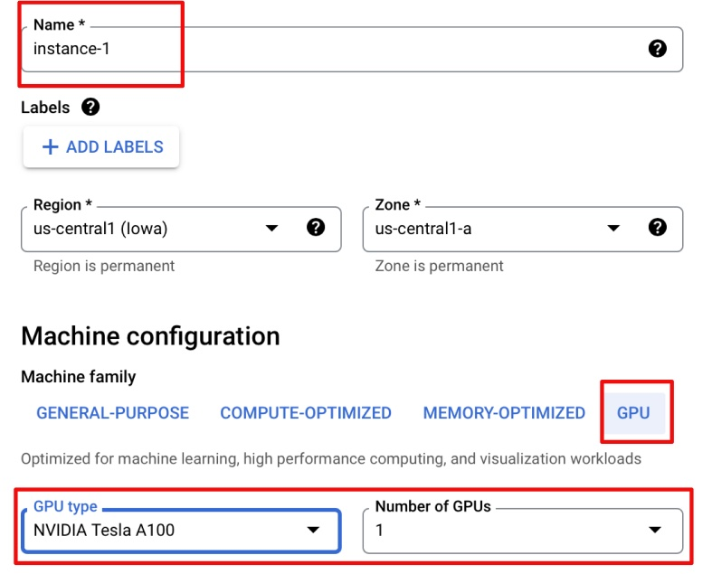
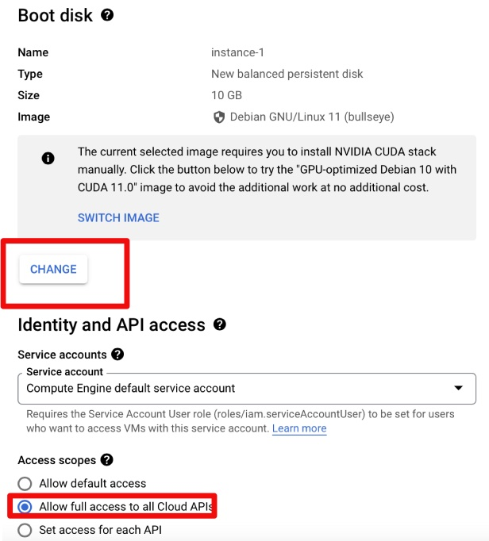
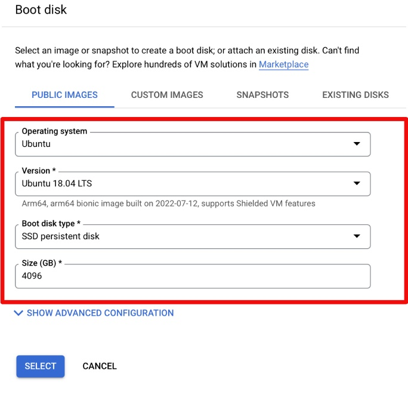

<h1>Long-read-sequencing Data Analysis Pipeline</h1>
<h2>Setting up GPU (in MIG mode) based VM </h2>

This document describes necessary steps to create a GPU enabled VM on google cloud platform (GPU) to run guppy basecaller on GPU in MIG mode.

### Step 1. Create VM

Google Cloud > Compute Engine > VM instances
Click “create instance”

Select proper name for your VM and Select GPU type and Number of GPUs 

Machine configuration : GPU 
GPU type: Nvidia Tesla A100
Number of GPUs: 1

Change Boot Disk type, size and OS 

For guppy runs, following settings work well with A100 GPU
For persistent disk Size (GB): please allocate  1Tb more than your largest sample size to allow enough space for results.

Start VM by clicking "SSH"

### Step 2. Setting up VM (GPU drivers and other tools)

Run: sudo apt-get update

Install anaconda: 

$ curl -O https://repo.anaconda.com/archive/Anaconda3-2021.05-Linux-x86_64.sh
$ bash Anaconda3-2021.05-Linux-x86_64.sh

follow prompts

Install necessary utilities:

sudo apt update 
sudo apt install build-essential 

Install NVIDIA GPU drivers:

curl https://raw.githubusercontent.com/GoogleCloudPlatform/compute-gpu-installation/main/linux/install_gpu_driver.py --output install_gpu_driver.py

sudo python3 install_gpu_driver.py

### Step 3. Verify that NVIDIA Drivers are installed properly and create MIG devices

(see https://codeyarns.com/tech/2020-12-15-how-to-use-mig.html for details)

To Check if the VM has a GPU and it is working properly.

$ nvidia-smi
 
Enable persistent Mode (by default it is disabled): 
$ sudo nvidia-smi -i 0 -pm ENABLED

enable MIG Mode: 
$ sudo nvidia-smi -i 0 -mig ENABLED (this should generate message saying “MIG mode enable is pending”)

Now restart VM to make sure that MIG mode is enabled

$ sudo reboot
click "retry" a few times 

Enable persistent mode again (it is always disable at every restart of VM):
$ sudo nvidia-smi -i 0 -pm ENABLED

Check that MIGs are created and everything is on:
$ nvidia-smi (this should show both persistent and mig mode enables)

### Step 4: Now create two MIG instances on GPU (for different options please above weblink):

$ sudo nvidia-smi mig -i 0 -cgi 9,9 (this will create 2 MIG devices each of 20GB RAM)

Next create compute instances for each MIG created in the last step:

$ sudo nvidia-smi mig -cci -i 0

By now we have two MIG devices and a compute instance for each MIG

To get MIG addresses: 
$ nvidia-smi -L 

Copy all MIG addresses for later use in the code to run code on.
Ex. MIG-cf446047-108a-51ed-9ec0-1a60f40c9a2f

### Step 5: To connect VM to gbucket

(https://github.com/GoogleCloudPlatform/gcsfuse/blob/master/docs/installing.md)

Install gcsfuse: 

$ export GCSFUSE_REPO=gcsfuse-`lsb_release -c -s` echo "deb http://packages.cloud.google.com/apt $GCSFUSE_REPO main" | sudo tee /etc/apt/sources.list.d/gcsfuse.list curl https://packages.cloud.google.com/apt/doc/apt-key.gpg | sudo apt-key add -

$ sudo apt-get update

$ sudo apt-get install gcsfuse

Create mount folder (folder that is connected to your bucket):

Go to root directory
$ cd

Create mount folder 
$ mkdir mountfolder 

Mount the folder using gcsfuse
$ gcsfuse --implicit-dirs {bucket_name} mountfolder

### Step 6: Install guppy base caller

Now that you can connect to bucket, go to root directory 
$ cd 

Copy guppy installer on the root directory of VM, untar it and copy it to /opt/guppy_version folder.

Create soft link to guppy as:

$ ls -s /opt/guppy_version/guppy_basecaller

Test guppy installation
$ ./guppy_basecaller (should run with errors as no input is provided) 

### IMPORTANT: AS GUPPY WORKS WITH HUGE NUMBER OF FILES, WE NEED TO MODIFY file limits in the limits.conf

Open file using following:

$ /etc/security/limits.conf 

Add following line at the end of the file
*               soft    nofile          65535
*               hard    nofile          65535

Save file.

### Step 7: Start guppying

Make run directory (in VM root)
$ mkdir run
$ cd run

Copy sh script (run_guppy_basecaller.sh/run_guppy_methylation.sh) and run using following command line (on terminal): PLEASE MAKE SURE THAT ALL THE RELATIVE PATHS IN THE SCRIPT ARE UPDATED PROPERLY

$ nohup bash guppy_script.sh > out.guppy_script.txt &

